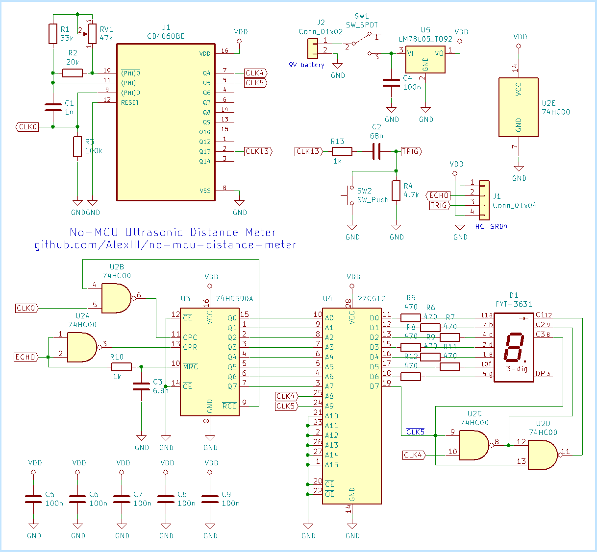
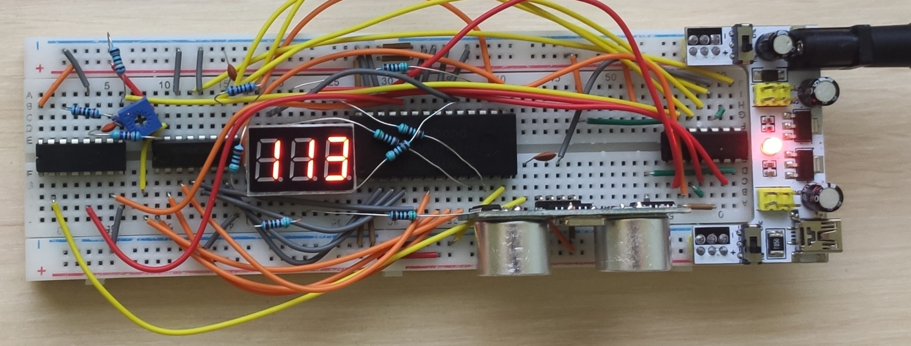
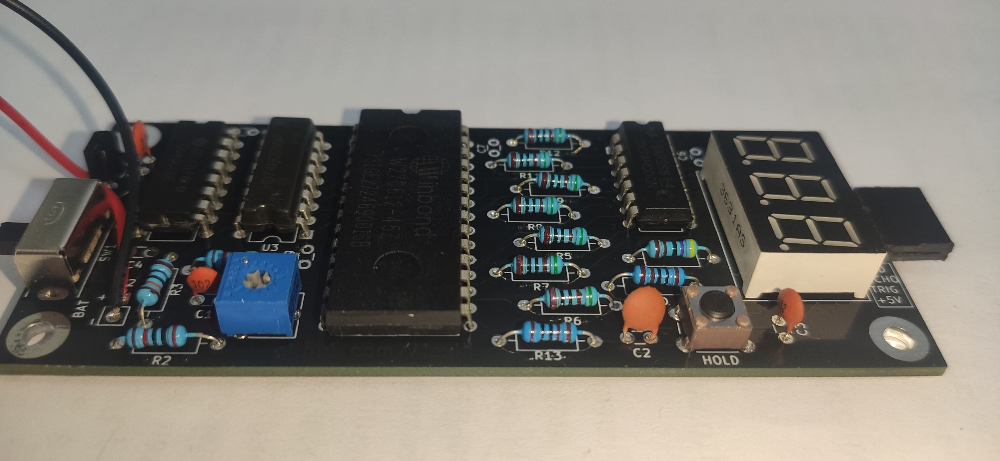
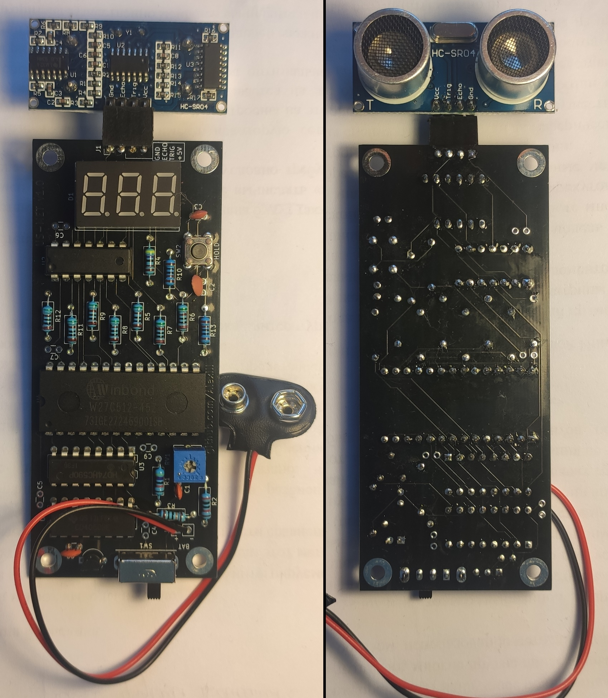
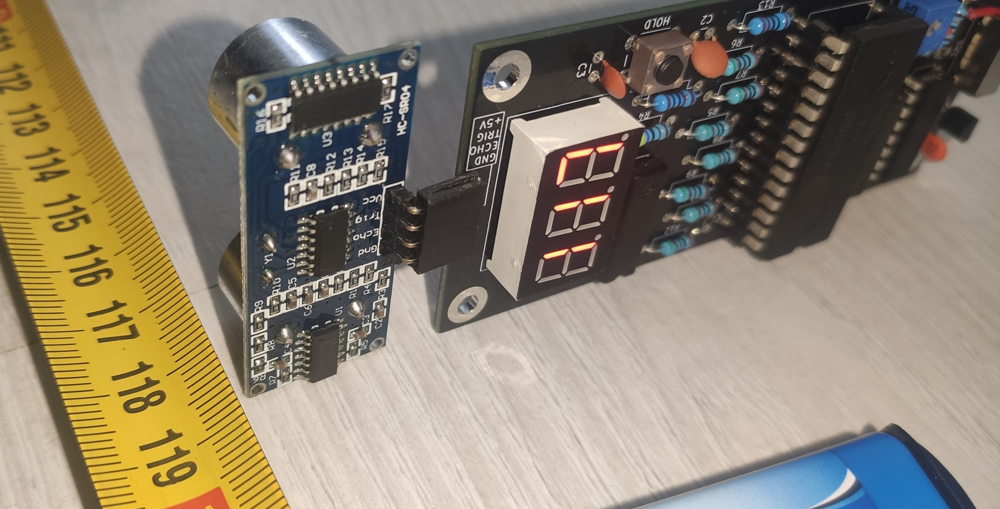

# No-MCU Ultrasonic Distance Meter

A Distance Meter that uses no MCU. Bases on ultrasonic ranging module [HC-SR04](https://cdn.sparkfun.com/datasheets/Sensors/Proximity/HCSR04.pdf).

The schematic employs just three standard logic ICs (8-bit counter, divider/oscillator, quad NAND) and a ROM chip (acts as a binary-to-decimal converter).

## Schematic

## Photos

## Project files

- `no-mcu-distance-meter-kicad5-prj/`  - KiCAD 5.1 project with the schematic and PCB design
- `eprom-programmer`  - Arduino sketch to program the ROM chip using mega2560 (see the sketch for the connections info).

## License

[CC BY-NC 4.0](https://creativecommons.org/licenses/by-nc/4.0/) © github.com/AlexIII